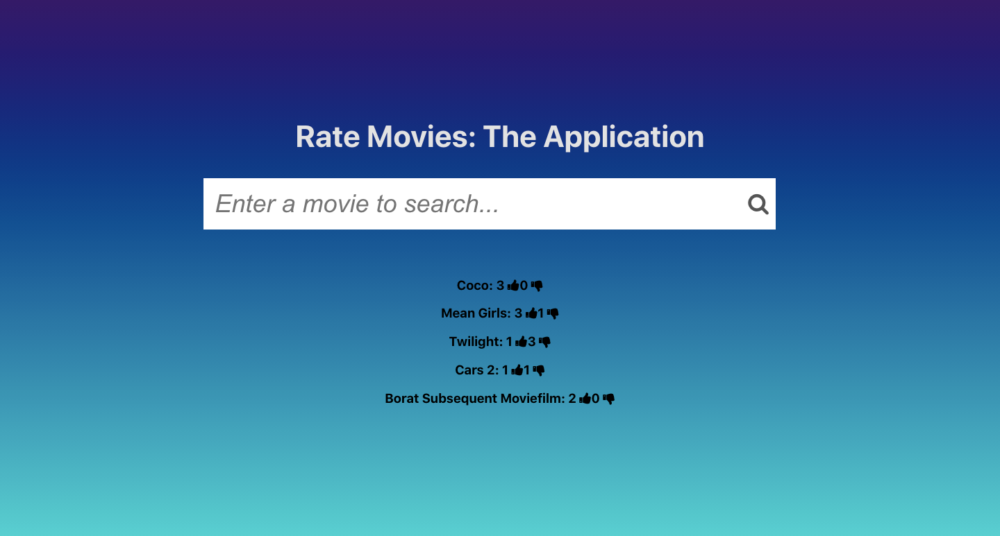
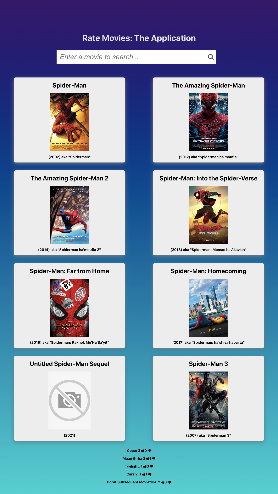
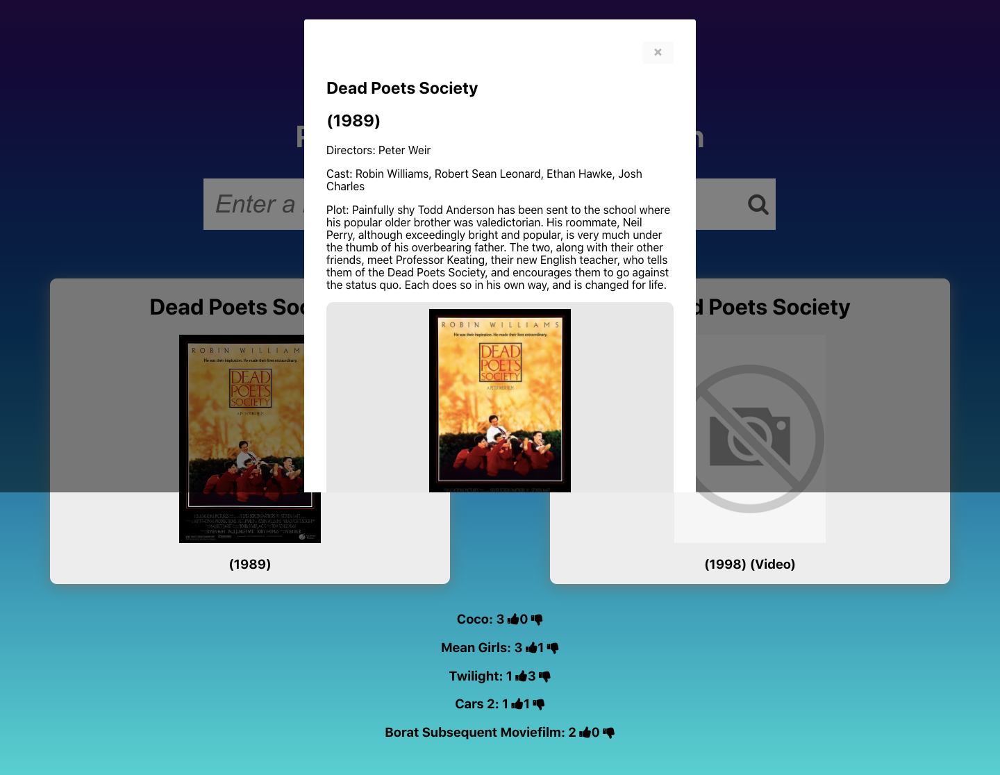

# Rate Movies: The Application

Keep track of movies you've seen by searching and rating them using this app that's connected to the [IMDB-API](https://imdb-api.com/api).

## How to Setup and Run

Clone the repository using the command line. Cd into the new repository. Install 'npm' and run the app using 'npm start'. View the app in the browser using [http://localhost:3000](http://localhost:3000).

